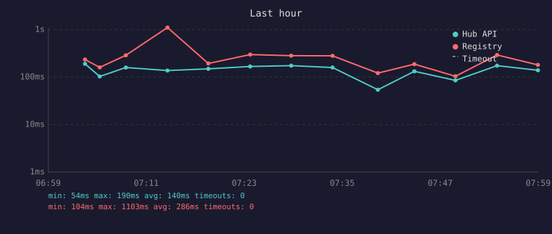
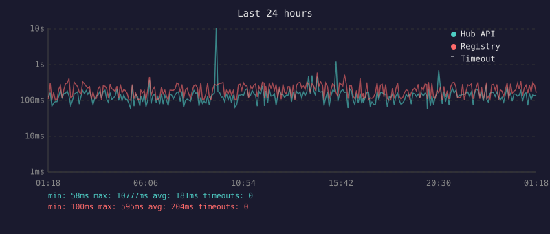
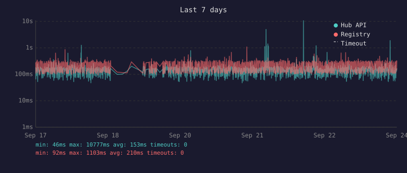
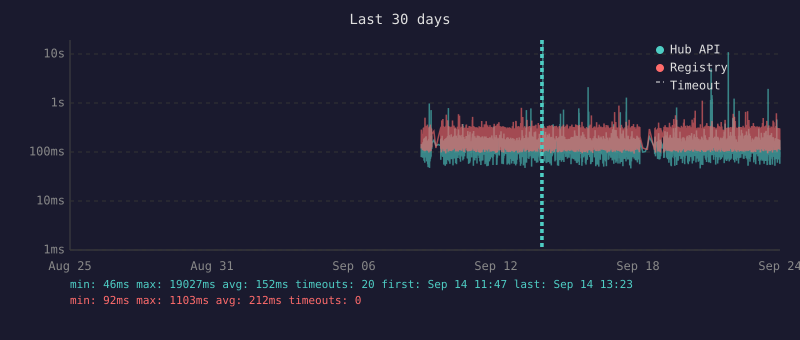

# Docker Hub Lag

Measures Docker Hub propagation delay: the time between a successful push and the moment the image becomes visible through different API paths.

Every 5 minutes, a GitHub Action pushes a tiny image to Docker Hub and polls two endpoints until the tag appears:

- Hub API: tag lookup via `hub.docker.com/v2/repositories/.../tags/...`
- Registry: manifest HEAD via `registry-1.docker.io`

Results are recorded in `data/lag.csv` and rendered as SVG charts below.

## Last hour


## Last 24 hours


## Last 7 days


## Last 30 days


## Local usage

```
go build -o docker-lag .
PAT=your_docker_hub_pat ./docker-lag --user=youruser --verbose
./docker-lag graph
```
